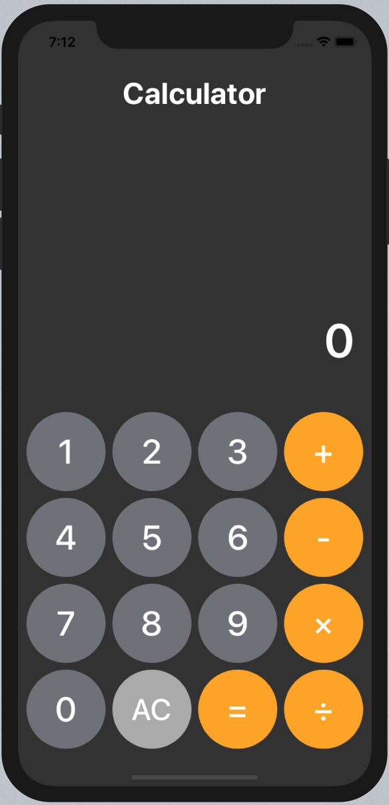

# 모법 답안 분석



## Step1) 기능구분하여 enum으로 정의

숫자, 연산자, 결과, 초기화 명령을 enum으로 정의

```swift
enum Command {
  case addDigit(String)
  case operation(String)
  case equal
  case clear
}
```

<br>

## Step2) enum으로 정의된 기능을 switch로 분기 시킨다

1. 각 버튼 이벤트가 발생했을때(@IBAction) 해당 버튼의 타이틀 값을 읽어와서 매칭되는 명령을 command 값에 할당한다.

2. 사칙연산과 숫자 버튼의 경우에는 타이틀("+", "-", "×", "÷"/"숫자")를 command의 관계값으로 설정한다.

```swift
@IBAction private func didTapButton(_ sender: UIButton) {
  guard let input = sender.currentTitle else { return }
  
  let command: Command
  switch input { // 1
  case "AC":
    command = .clear
  case "=":
    command = .equal
  case "+", "-", "×", "÷": 
    command = .operation(input) // 2
  default:
    command = .addDigit(input) // 2
  }
}
```

<br>

## Step3) 화면을 출력하는 연산프로퍼티를 정의

프로퍼티에 새 값이 들어오면 displayLabel.text를 통해 출력

```swift
private var displayValue: String {
  get { return displayLabel.text ?? "" }
  set { displayLabel.text = newValue }
}
```

그래서 버튼 이벤트(@IBAction)에 사용

```swift
@IBAction private func didTapButton(_ sender: UIButton) {
  guard let input = sender.currentTitle else { return }
  
  let command: Command
  switch input {
  case "AC":
    command = .clear
  case "=":
    command = .equal
  case "+", "-", "×", "÷":
    command = .operation(input)
  default:
    command = .addDigit(input)
  }
  let result = performCommand(command, with: displayValue) // command를 실행해서 그 결과를 result에
  displayValue = limitFractionDigits(to: result) // 그 result를 자리수를 조절해서 출력
  print("display : \(displayValue), command : \(command)")
}
```

<br>

## Step4) performCommand 함수 작성(addDigit 부분)

command(사칙연산, 숫자입력, equal, clear)을 실행할 함수, performCommand 함수 작성

```swift
private func performCommand(_ command: Command, with displayText: String) -> String {
  switch command {
  case .addDigit(let input): // addDigit 요소에 관계값을 받기 위해 let input
    return displayText + input // 기존 숫자에 추가. ex) 12 -> 123
  case .operation(_):
    break
  case .equal:
    break
  case .clear:
    break
  }
  return "0"
}
```

<br>

## Step5) addDigit 함수 작성

```swift
private var accumulator = 0.0
private var bufferOperator: String?
private var shouldResetText = true

ivate func addDigit(value newValue: String, to oldValue: String) -> String {
	// 3항 연산자 중첩
  let displayString = shouldResetText ? newValue // 화면 리셋 플레그 온이면 새값 오프면 
    : oldValue.count > 13 ? oldValue // 지금까지 화면에 표시된 자리가 13자리 이상이면 기존 값 유지
    : oldValue + newValue // 미만이면 새값 계속 입력
  shouldResetText = false // 화면 리셋 플레그 오프
  return displayString
}

private func performCommand(_ command: Command, with displayText: String) -> String {
  switch command {
  case .addDigit(let input):
    return addDigit(value: input, to: displayText) // addDigit 기능을 함수로 따로 개선 작성
  case .operation(_):
    break
  case .equal:
    break
  case .clear:
    break
  }
  shouldResetText = true // 화면 리셋 플레그 온
  return "0"
}
```

<br>

## Step6) calculator 함수(operation command) 작성

```swift
private func calculate(for newValue: String) -> Double {
  let operand = Double(newValue)!
  
  switch bufferOperator { // 한 스텝 전에 누른 연산자를 저장하는 버퍼
  case "+": return accumulator + operand // accumulator: 이전 연산결과를 저장할 변수(=prevNum)
  case "-": return accumulator - operand // operand: 새로 입력된 digit(=newNum)
  case "×": return accumulator * operand
  case "÷": return accumulator / operand
  default: return operand
  }
}

private func performCommand(_ command: Command, with displayText: String) -> String {
  var result: Double?
  switch command {
  case .addDigit(let input):
    return addDigit(value: input, to: displayText)
  case .operation(let op):
    accumulator = calculate(for: displayText) // 새로 입력된 digit인 displayText와 연산
    bufferOperator = op
    result = accumulator
  case .equal:
    break
  case .clear:
    break
  }
  shouldResetText = true
  return String(result ?? 0) // .equal, .clear 케이스의 경우 "0"으로 반환되도록
}
```

<br>

## Step7) 자릿수를 제어할 함수, limitFractionDigits( )작성

```swift
private func limitFractionDigits(to numString: String) -> String {
  guard let number = Double(numString) else { return "0" }
  let formatter = NumberFormatter()
  formatter.minimumFractionDigits = 0
  formatter.maximumFractionDigits = 3
  return formatter.string(from: number as NSNumber) ?? "0"
}
```

<br>

## Step8) AC(clear)와 =(equal) 기능 추가

```swift
  private func performCommand(_ command: Command, with displayText: String) -> String {
    var result: Double?
    switch command {
    case .addDigit(let input):
      return addDigit(value: input, to: displayText)
    case .operation(let op):
      accumulator = calculate(for: displayText)
      bufferOperator = op
      result = accumulator
    case .equal:
      result = calculate(for: displayText) // 현재 입력값(newNum)과 계산 결과를 반환하고
      accumulator = 0 // 누적값 초기화
      bufferOperator = nil // 연산자 버퍼 초기화
    case .clear:
      accumulator = 0 // 계산할 필요도 없이 누적값 초기화
      bufferOperator = nil // 연산자 버퍼 초기화
    }
    shouldResetText = true
    return String(result ?? 0)
  }
```

<br>

## Step9) MVC 패턴으로 분리

M - Model => 비즈니스 로직, 데이터 로직: 껍데기에 상관없는 구동 로직

V - View =>Storyboard, 코딩: 해당 앱에서만 한정되어있는 것, 화면 꾸미는것

C - ViewController: 모델의 내용을 뷰에 출력시켜줌


* Model에 해당하는 요소
  * addDigit()
  * calculate()
  * performCommand()
* Model을 class 혹은 struct로 작성

```swift
import Foundation

final class Calculator {
  // code...
  private func addDigit(value newValue: String, to oldValue: String) -> String {
    // code...
  }
  private func calculate(for newValue: String) -> Double {
    // code...
  }
  // code...
  private func performCommand(_ command: Command, with displayText: String) -> String {
    // code...
  }
}
```

* Controller에 해당하는 요소
  * didTapButton(): 뷰에서 터치된 상황을 처리
  * limitFractionDigits(): 뷰에 표시될 상황을 처리

```swift
import UIKit

final class ViewController: UIViewController {
  
  @IBOutlet private weak var displayLabel: UILabel!

  //private let calculator = Calculator() // private으로 선언하면 아래서 못씀
  let calculator = Calculator()
  
  // code...
  
  // 뷰에서 발생한 이벤트로 인해 생성된 데이터를 모델로 전달(=Model의 메소드 호출)
  @IBAction private func didTapButton(_ sender: UIButton) {
    // code...
  }
  
  // code...
  
  let result = calculator.performCommand(command, with: displayValue) // Model의 메소드를 호출
  
  // code...
  
  // Model에서 가공된 데이터를 특정한 방식으로 뷰로 출력
  private func limitFractionDigits(to numString: String) -> String {
    // code...
  }
}
```

<br>

## Step10) perfomCommand() 간소화

누적값과 연산자를 각각 누적값변수와 버퍼에 저장하는 함수, changeState()를 만들어서 operation command 케이스의 실행문을 줄인다.

```swift
private func changeState(accumulator: Double, op: String? = nil) {
  self.accumulator = accumulator
  bufferOperator = op
} // 계산결과와 연산자를 각각 계산결과와 버퍼에 옮기는 함수

func performCommand(_ command: Command, with displayText: String) -> String {
  var result: Double?
  switch command {
  case .addDigit(let input):
    return addDigit(value: input, to: displayText)
  case .operation(let op):
    changeState(accumulator: calculate(for: displayText), op: op)
    result = accumulator
  case .equal: result = calculate(for: displayText)
    fallthrough // 여기서도 changeState(accumulator: 0)실행해야 해서 그냥 밑에 있으니까 fallthrough로 해결
  case .clear: changeState(accumulator: 0)
  }
  shouldResetText = true
  return String(result ?? 0)
}
```

<br>

## Step11) calculator 함수를 enum 프로퍼티를 이용해 축소

```swift
  private enum Operator: String {
    case addition = "+"
    case subtraction = "-"
    case multiplication = "×"
    case division = "÷"
    
    var calculate: (Double, Double) -> Double {
      switch self { // 클로저
      case .addition:         return { $0 + $1 }
      case .subtraction:      return { $0 - $1 }
      case .multiplication:   return { $0 * $1 }
      case .division:         return { $0 / $1 }
      }
    }
  }

  private func calculate(for newValue: String) -> Double {
    let operand = Double(newValue)!
    
    // switch-case 부분을 이렇게 변경
    return (bufferOperator != nil)
      ? bufferOperator!.calculate(accumulator, operand)
      : operand
  }
```

<br>

## Step12) 클로저부분을 축약

```swift
var calculate: (Double, Double) -> Double {
      switch self { // 클로저
      case .addition:         return (+) // 이항 연산자의 경우 이렇게 가능
      case .subtraction:      return (-)
      case .multiplication:   return (*)
      case .division:         return (/)
      }
```

<br>

## Step13) 삼항연산자를 nil병합 연산자로 축약

```swift
return bufferOperator?.calculate(accumulator, operand) ?? operand
```

<br>

## Step14) 연산자 변경 기능 추가

```swift
func performCommand(_ command: Command, with displayText: String) -> String {
  // code...
  
  case .operation(let op):
    let hasChangedOp  = bufferOperator != nil && shouldResetText // 연산자가 터치되면, 숫자가 터치되면
    let accu = hasChangedOp ? accumulator : calculate(for: displayText) // 연산자만 바뀌고, 계산.
    result = hasChangedOp ? Double(displayText) : accu

  // code...
  
  shouldResetText = true
  return String(result ?? 0)
}
```

<br>

## Step15) 천단위마다 콤마표시

```swift
  @IBAction private func didTapButton(_ sender: UIButton) {

    // code...
    
    let removedCommaString = displayValue.replacingOccurrences(of: ",", with: "") // 계산에 사용되는 값에는 ,를 제거
    let newState = calculator.performCommand(command, with: removedCommaString) // 계산
    displayValue = limitFractionDigits(to: newState) // 다시 , 붙여준다
    print("display : \(displayValue), command : \(command)")
  }
  
// 1000 단위마다 , 찍어준다. 하지만 콤마가 찍히고 다음 수가 들어올때 
  private func limitFractionDigits(to numString: String) -> String {
    guard let number = Double(numString) else { return "0" }// 여기서 0으로 만든다
    let formatter = NumberFormatter()
    formatter.numberStyle = .decimal
    formatter.minimumFractionDigits = 0
    formatter.maximumFractionDigits = 3
    return formatter.string(from: number as NSNumber) ?? "0"
  }
```

<br>

## Step 16) UI 커스터마이징

* 많은 수의 같은 UI 요소들을 스토리보드를 사용하여 설정하는 것 => 굉장히 비효율적이고 매우 별로

* 해결책 => UIButton의 커스텀 클래스를 만든다.

<br>

방법 1) 각 버튼의 custom class에 class를 연결해준다.


```swift
import UIKit

@IBDesignable // 스토리보드에 바로 적용되서 보인다.
final class KeypadButton: UIButton {
  
  var cornerRadius: CGFloat = 0 {
    didSet { layer.cornerRadius = cornerRadius }
  }
  
  // 적당한 delegate 단계에 넣어줘야한다. 예를 들어 viewDidLoad는 이미 화면이 올려졌기 때문에 부적절
  override func layoutSubviews() {
    super.layoutSubviews()
    cornerRadius = frame.width / 2
  }
}
```

방법 2) 스토리보드의 Inspecter에 속성을 추가해서 수정할 수 있게 하는 것

@IBInspectable 사용한다


```swift
import UIKit

@IBDesignable // 스토리보드에 바로 적용되서 보인다.
final class KeypadButton: UIButton {
  
  @IBInspectable // 인터페이스 빌더에 아래 내용을 추가
  var cornerRadius: CGFloat = 0 {
    didSet { layer.cornerRadius = cornerRadius }
  }
}
```


## 추가) 프린트 찍을때 보기 좋게 만드는 방법

```swift
let padStr = "\(command)".padding(toLength: 14, withPad: " ", startingAt: 0)
print("command: \(padStr) / display: \(displayValue)")
```

